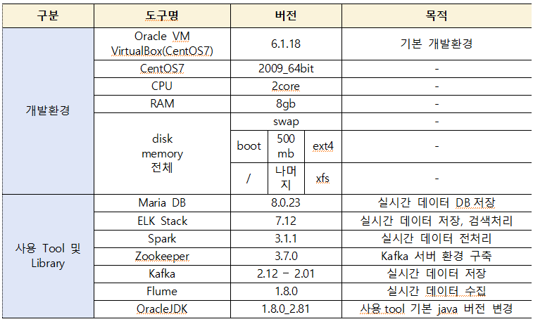
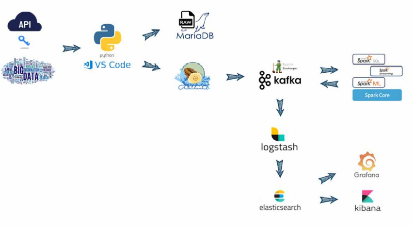
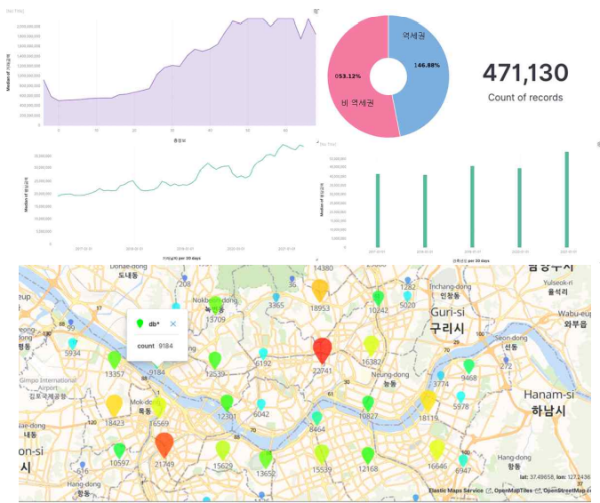
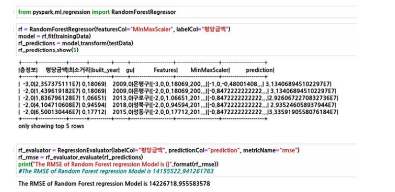
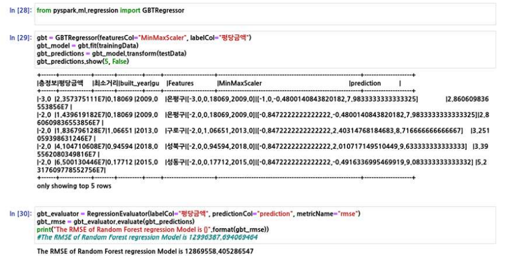
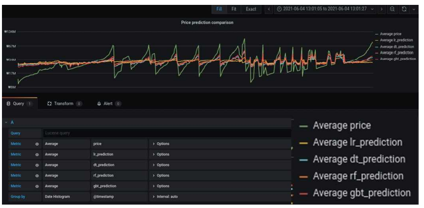

 # 역세권이 아파트에 미치는 영향 구해줘 홈!
 
 ### 기간  
 2021.5.31~2021.6.4  
 
 ### 내용   
 리눅스 가상환경(CentOS7)에 빅데이터 플랫폼을 구축 후 부동산 가격예측 및 역세권과 상관관계 추정   
 
 ### 상세 과정
1. VirtualBox VM에 Linux Centos7 2009ver 64bit 기반으로 설치. 
2. 국토교통부에서 5년간의 부동산 Data와 공공데이터포탈에서 지하철역 위치 Data 수집 하고 서울 열린 데이터 광장에서 Open API로 실시간 거래정보를 가져와 python으로 전 처리하여 CSV파일로 저장
3. 전처리된 CSV파일은 MariaDB에 원본(RawData)를 적재하고 실시간 분석을 위한 변환Data는 Flume을 통해 Kafka로 전송
4. Kafka에서 Spark로 Data를 전송하고 ML model을 만들어 실시간 분석에 대한 데이터를 생성하여 다시 Kafka에 전송
5. Logstash를 통해 Kafka의 ML 데이터를 받아 ElasticSearch에 전달해 Mapping 확인한 후 Grafana와 Kibana로 데이터 시각화
( ML-model로 집값 상승률 예측과 서울지역의 평당 집값에 대한 위치 시각화 )
 
 ### 사용 기술 stack
 
 

### System Architecture  

     

## 인원 및 역할  
  - 총원 5명 
  - 역할 : 파이프라인 구축 및 연동, 데이터 전처리 및 시각화
## 상세 역할
  
 **< part (1) : 데이터 수집 및 전처리 >**   
  - 국토교통부에서 5년간의 부동산 Data와 공공데이터포탈에서 지하철역 위치 Data 수집하고 서울 
    열린 데이터 광장에서 Open API로 실시간 거래정보를 가져와 python으로 전처리하여 CSV 파일      로 저장

  **< part (2) : 파이프라인 구축 및 연동 >**      
  - 데이터 플랫폼 구축 및 연동
   (mariadb or flume->logstash->kafka->spark->elasticsearch->kibana or grafana)
 
  **< part (3) : 데이터 시각화 >**  
  - Logstash를 통해 Kafka의 ML 데이터를 받아 ElasticSearch에 전달해 Mapping 확인한 Grafana와 Kibana로 데이터 시각화 ( ML-model로 집값 상승률 예측과 서울지역의 평당 집값에 대한 위치 시각화  

## 프로젝트 결과

  
 **kibana 시각화 결과**

**pyspark Decision Tree 결과：RMSE(오차) 약 1380만원**  
 
**pyspark Random Forrest 결과：RMSE(오차) 약 1420만원**  
   
**pyspark GBT 결과：RMSE(오차) 약 1290만원**  
   
**grafana 시각화 결과**  

### 개선 사항
- 전체 시스템 실시간 자동화를 해내지 못했다. (CronTab or Airflow 시간 부족으로 미사용)   
- SparkML 실시간 분석 자동화를 시도했으나 구현을 완성하지 못하였다. 
- ML feature 및 좀 더 분석하고 고민 해볼 시간이 없어서 Model에 대한 완성도가 아쉬웠다.
